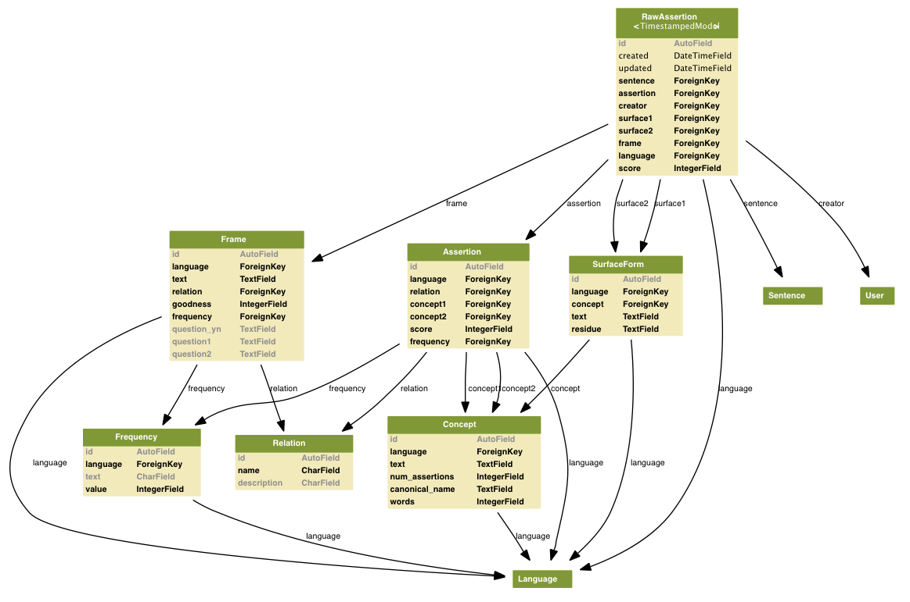

.. _conceptnet4: 
    
The :mod:`conceptnet4` module
=============================

The :mod:`conceptnet4` module contains the :class:`Concept`,
:class:`Relation`, :class:`Assertion`, :class:`RawAssertion`,
:class:`Frame`, :class:`SurfaceForm`, and :class:`Frequency` models, whose
database structure appears in the following figure:

It also provides the non-database classes :class:`Proposition` and
:class:`Feature`.

.. automodule:: conceptnet4.models

Concepts
--------

.. autoclass:: Concept
    :members: get, get_raw, get_assertions, get_assertions_forward, get_assertions_reverse, some_surface
    
    .. attribute:: language

        The :class:`Language` that this concept is in.
    
    .. attribute:: text

        The normalized text for this concept.

    .. attribute:: num_assertions
        
        A cached value representing how many :class:`Assertion` s this concept appears in.
    
    .. attribute:: words
        
        A cached value for the number of words in the concept's normalized
        form. This gives an estimate of the complexity of the concept.

Relations
---------

.. autoclass:: Relation
    
    ConceptNet has a closed class of Relations, expressing connections between
    Concepts. This is the current set of relations, according to what
    question they each answer::

         IsA                   | What kind of thing is it?
         HasA                  | What does it possess?
         PartOf                | What is it part of?
         UsedFor               | What do you use it for?
         AtLocation            | Where would you find it?
         CapableOf             | What can it do?
         MadeOf                | What is it made of?
         CreatedBy             | How do you bring it into existence?
         HasSubevent           | What do you do to accomplish it?
         HasFirstSubevent      | What do you do first to accomplish it?
         HasLastSubevent       | What do you do last to accomplish it?
         HasPrerequisite       | What do you need to do first?
         MotivatedByGoal       | Why would you do it?
         Causes                | What does it make happen?
         Desires               | What does it want?
         CausesDesire          | What does it make you want to do?
         HasProperty           | What properties does it have?
         ReceivesAction        | What can you do to it?
         DefinedAs             | How do you define it?
         SymbolOf              | What does it represent?
         LocatedNear           | What is it typically near?
         ObstructedBy          | What would prevent it from happening?
         ConceptuallyRelatedTo | What is related to it in an unknown way?
         InheritsFrom          | (not stored, but used in some applications)

    .. attribute:: text

        A standardized string naming this relation.

Assertions
----------

.. autoclass:: Assertion
    :members: best_raw

    An Assertion is uniquely defined by the five properties
    (:attr:`language`, :attr:`relation`, :attr:`concept1`, :attr:`concept2`,
    :attr:`frequency`).

    .. attribute:: language
    
        The :class:`Language` that the assertion is expressed in.

    .. attribute:: relation

        The :class:`Relation` that connects the two concepts in this assertion.

    .. attribute:: concept1

        The :class:`Concept` that is the first argument of the relation.

    .. attribute:: concept2

        The :class:`Concept` that is the second argument of the relation.

    .. attribute:: frequency

        A :class:`Frequency` expressing how often the given concepts would be
        related by the given relation, ranging from "never" to "always".

    .. attribute:: polarity

        A coarse-grained version of the :attr:`frequency`. The polarity is +1
        if the assertion makes a positive statement (such as "people want to be
        happy") and -1 if it makes a negative statement (such as "people do not
        want to be shot").
    
    .. attribute:: score

        A cached value representing the reliability of this Assertion: the
        number of people who support it (including anyone who entered a
        :class:`Sentence` that it represents), minus the number of people who
        oppose it. The score is determined from the :class:`voting.Vote`
        objects that apply to this Assertion.

RawAssertions
-------------
.. autoclass:: RawAssertion
    :members: nl_repr, set_rating

    .. attribute:: sentence

        The :class:`Sentence` that was parsed to form this RawAssertion.

    .. attribute:: assertion

        The :class:`Assertion` that this RawAssertion describes.

    .. attribute:: creator

        The :class:`User` responsible for this RawAssertion.

    .. attribute:: frame
        
        The :class:`Frame`, or the natural language template whose slots are
        filled in by this RawAssertion.

    .. attribute:: surface1

        The :class:`SurfaceForm` of the phrase (concept) that fills the first
        slot of the frame.

    .. attribute:: surface2

        The :class:`SurfaceForm` of the phrase (concept) that fills the second
        slot of the frame.

    .. attribute:: language

        The :class:`Language` that this RawAssertion is in.

    .. attribute:: score

        A cached value representing the reliability of this RawAssertion: the
        number of people who support it (including the person who originally
        entered it), minus the number of people who oppose it. The score is
        determined from the :class:`voting.Vote` objects that apply to this
        RawAssertion.

.. _features:

Features
--------
.. autoclass:: Feature
    :members: __init__, matching_assertions, matching_raw, fill_in, from_tuple, nl_statement, frame

    .. attribute:: relation

        The :class:`Relation` contained in this feature.

    .. attribute:: concept

        The :class:`Concept` contained in this feature.

.. _propositions:

Propositions
------------
.. autoclass:: Proposition
    :members: __init__, nl_question

    .. attribute:: relation

        The :class:`Relation` expressed by this proposition.

    .. attribute:: concept1

        The first argument of the relation.
    
    .. attribute:: concept2

        The second argument of the relation.

    .. attribute:: lang

        The language that this proposition is in.

Frames
------
.. autoclass:: Frame
    :members: fill_in

.. _`surface forms`:

Surface forms
-------------
.. autoclass:: SurfaceForm

    .. attribute:: text
        
        The text of this SurfaceForm.

    .. attribute:: language
        
        The language that this SurfaceForm is in.

    .. attribute:: concept

        The :class:`Concept` that this SurfaceForm expresses.

    .. attribute:: residue

        A string representation that indicates how to reconstruct this
        SurfaceForm from the normalized text of a :class:`Concept`. Not yet
        standardized.
        
        As an example, the surface form "playing a game" breaks down into the
        concept ``<en: play game>`` and the residue ``1+ing a 2``.

