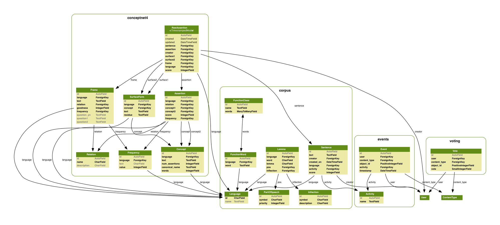

.. ConceptNet documentation master file, created by sphinx-quickstart on Fri Feb 27 14:59:14 2009.
   You can adapt this file completely to your liking, but it should at least
   contain the root `toctree` directive.

.. _root:

ConceptNet API
==============

Contents:

.. toctree::
   :maxdepth: 2

   install
   conceptnet4
   corpus
   others

Overview and apology
--------------------

The current ConceptNet API has the ability to access two versions of the
database: ConceptNet 3 and the experimental ConceptNet 4. We call this the
"ConceptNet 3.5" API, pronounced "ConceptNet three and a half".

Except this isn't quite a release of ConceptNet 3.5 yet. We're working on it.

Most of our released code, as well of our released database, take the form of
ConceptNet 3. However, ConceptNet 3 has become a bit of a mess as a result of
years of research and paper deadlines.

This documentation, then, will mostly document ConceptNet 4. Much of what we
say will work about the same in ConceptNet 3. But some of it won't. We're sorry
about that.

How does this code work?
------------------------
The answer from 30,000 feet up is simple: It's Django.

Django is a Python framework for working with databases and web applications.
All of ConceptNet is represented as Django models that interact with each other
and with a database. We don't use the web application part -- not here, at
least -- but we provide the appropriate hooks so that ConceptNet can power a
Django web application. (Because it does. It's at
http://openmind.media.mit.edu.)

The code is divided into a few main modules, or *apps*:

- :mod:`corpus`, representing the sentences of glorious, ambiguous natural
  language that our contributors have provided us with.
- :mod:`conceptnet` (or :mod:`conceptnet4`), representing the structured
  assertions that we have parsed from the corpus.
- :mod:`events`, which lets us keep track of how, when, and why various objects
  came into being.
- (:mod:`voting`, which actually isn't by us at all; it's the `django-voting`_
  package by Jonathan Buchanan.)

.. _`django-voting`: http://code.google.com/p/django-voting/

:mod:`conceptnet` and :mod:`conceptnet4` are two conflicting implementations of the
same idea. In :file:`settings.py`, we refer to :mod:`conceptnet`. If you have a
database of ConceptNet 4 and a desire to live on the edge, you can change it to
:mod:`conceptnet4`.

Model diagram
-------------
Each app contains several *models*, representing objects that are stored in a
database. The information in ConceptNet is represented by these models and
their relationships to each other.

(`PDF version`_)

.. _`PDF version`: _static/graph/conceptnet_all.pdf

Components
----------
- :ref:`conceptnet4`
- :ref:`corpus`
- :ref:`others`

Indices and tables
==================

* :ref:`genindex`
* :ref:`modindex`
* :ref:`search`

